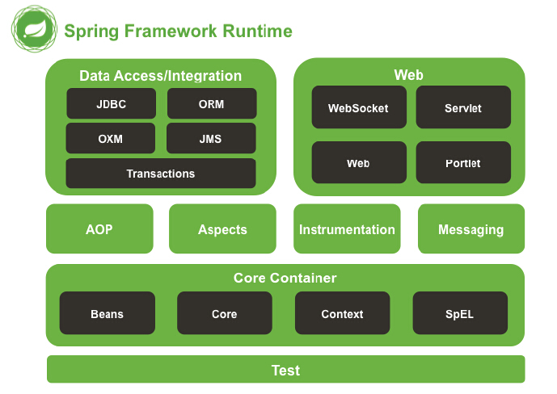
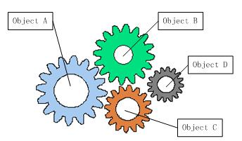
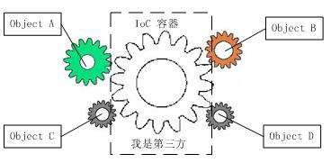
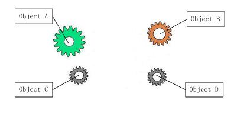
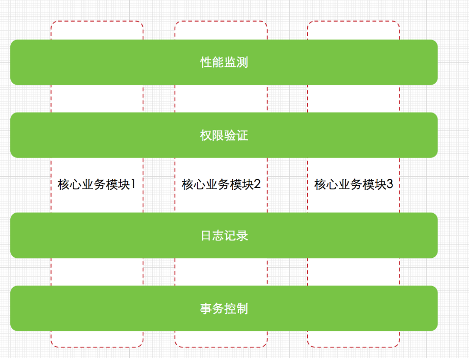
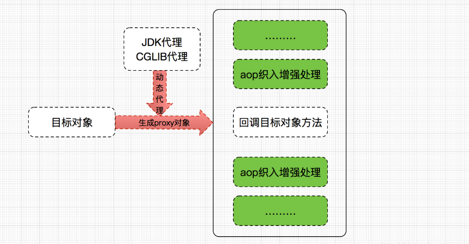

Spring入门第一步
===========

Spring是什么
------------

spring是一个**轻量**级的**控制反转(IoC)**和**面向切面(AOP)**的**容器**框架。

### **◆轻量**——

从大小与开销两方面而言Spring都是轻量的。完整的Spring框架在一个大小1MB多的JAR文件里发布。并且Spring所需的处理开销也是微不足道的。

### **◆控制反转**——

Spring通过一种称作控制反转（IoC）的技术促进了松耦
合。IOC的具体概念会在下文进行详细解释

### <br>**◆面向切面**——

Spring提供了面向切面编程的丰富支持，允许通过分离应用的
业务逻辑与系统级服务进行内聚性的开发。AOP的具体概念会在下文进行详细解释

### **◆容器**——

Spring包含并管理应用对象（Bean）的配置和生命周期，在这个意义上它是
一种容器，你可以配置你的每个bean如何被创建——基于一个可配置原型（prototype），你的bean可以创建一个单独的实例或者每次需要时都生成一个新的实例——以及它们是如何相互关联的。

Spring 的作用
-------------

Spring的使用范围包括普通的JAVA程序也可用于Web开发

Spring的主要作用分别为IOC、AOP

Spring的结构
------------



**Core Container：**

spring-core和spring-beans提供了 Spring 框架的基本功能，包括控制反转（Inversion
of Control，简称IOC）和依赖注入（Dependency
Injection简称DI）的特性。（Spring最最最最重要的东西）

**核心容器（敲黑板！开篇说Spring是个容器就是因为这个东西，大家的小眼睛看清楚了！！！）**的主要组件是**BeanFactory**，它是工厂模式的实现。BeanFactory将应用程序的配置和依赖性规范与实际的应用程序代码分开。

spring-context是一个配置文件，向 Spring 框架提供上下文信息。

### AOP and Instrumentation（Spring的另一重大特性）

Spring AOP 模块直接将面向方面的编程功能集成到了 Spring 框架中。

单独的spring-aspects模块用来支持与AspectJ的集成。

spring-instrument模块提供在特定的应用程序服务器类加载器实现。

Spring IOC（Inversion of Control控制反转，重头戏！）
----------------------------------------------------

### 什么是IOC

未使用Spring之前，组件之间的协调关系是由程序内部代码来控制的，或者说，以前我们使用New关键字来实现两组间之间的**依赖关系**的。（忘记什么叫依赖关系的同学可以找一下UML图中的依赖关系）

这种方式就造成了组件之间的互相耦合。IOC就是来解决这个问题的，它将实现组件间的关系从程序内部提到外部容器来管理。也就是说，由容器在运行期将组件间的某种依赖关系动态的注入组件中。

不明白耦合的同学看这里\~明白的往下跳：



齿轮组中齿轮之间的啮合关系,与软件系统中对象之间的耦合关系非常相似

既然有耦合，那么就有松耦合：


我们再把中间的IOC容器当作透明不看



这样的话我们在开发过程中只要注重当前的一个Object就行了，不用去管如何与其他的Object进行依赖

### IOC的实现—DI(Dependency Injection 依赖注入)

定义：**依赖注入**就是将实例变量传入到一个对象中去

什么是依赖

如果在 Class A 中，有 Class B 的实例，则称 Class A 对 Class B
有一个依赖。例如下面类 Human 中用到一个 Father 对象，我们就说类 Human 对类
Father 有一个依赖。
```
public class Human {

...

Father father;

...

public Human() {

father = new Father();

}

}
```
仔细看这段代码我们会发现存在一些问题：

1.  如果现在要改变 father 生成方式，如需要用new Father(String name)初始化
    father，需要修改 Human 代码；

2.  如果想测试不同 Father 对象对 Human 的影响很困难，因为 father
    的初始化被写死在了 Human 的构造函数中；

3.  如果new Father()过程非常缓慢，单测时我们希望用已经初始化好的 father
    对象模仿这个过程也很困难。

上面将依赖在构造函数中直接初始化是一种 Hard init
方式，弊端在于两个类不够独立，不方便测试。我们还有另外一种 Init 方式，如下：
```
public class Human {


Father father;


public Human(Father father) {

this.father = father;

}

}
```
上面代码中，我们将 father 对象作为构造函数的一个参数传入。在调用 Human
的构造方法之前外部就已经初始化好了 Father
对象。像这种**非自己主动初始化依赖，而通过外部来传入依赖的方式，我们就称为依赖注入。**  
现在我们发现上面 1
中存在的两个问题都很好解决了，简单的说依赖注入主要有两个好处：

1.  解耦，将依赖之间解耦。

2.  因为已经解耦，所以方便做单元测试，尤其是 模拟测试。

附上一篇博客：<https://blog.csdn.net/javazejian/article/details/54561302>

Spring AOP
----------

### 什么是AOP

一张图让你明白AOP （Aspect Oriented Programming 面向切面编程）



每个关注点与核心业务模块分离，作为单独的功能，横切几个核心业务模块，这样的做的好处是显而易见的，每份功能代码不再单独入侵到核心业务类的代码中，即核心模块只需关注自己相关的业务，当需要外围业务(日志，权限，性能监测、事务控制)时，这些外围业务会通过一种特殊的技术自动应用到核心模块中，这些关注点有个特殊的名称，叫做“横切关注点”，上图也很好的表现出这个概念，这种抽象级别的技术就叫AOP（面向切面编程）

### AOP的实现-AspectJ

public class HelloWord {

public void sayHello(){

System.out.println("hello world !");

}

public static void main(String args[]){

HelloWord helloWord =new HelloWord();

helloWord.sayHello();

}

}

public aspect MyAspectJDemo {

/\*\*

\* 定义切点,日志记录切点

\*/

pointcut recordLog():call(\* HelloWord.sayHello(..));

/\*\*

\*
定义切点,权限验证(实际开发中日志和权限一般会放在不同的切面中,这里仅为方便演示)

\*/

pointcut authCheck():call(\* HelloWord.sayHello(..));

/\*\*

\* 定义前置通知!

\*/

before():authCheck(){

System.out.println("sayHello方法执行前验证权限");

}

/\*\*

\* 定义后置通知

\*/

after():recordLog(){

System.out.println("sayHello方法执行后记录日志");

}

}

输出结果：


### AOP的实现- Spring AOP

//接口类

public interface UserDao {

int addUser();

void updateUser();

void deleteUser();

void findUser();

}

//实现类

import com.zejian.spring.springAop.dao.UserDao;

import org.springframework.stereotype.Repository;

\@Repository

public class UserDaoImp implements UserDao {

\@Override

public int addUser() {

System.out.println("add user ......");

return 6666;

}

\@Override

public void updateUser() {

System.out.println("update user ......");

}

\@Override

public void deleteUser() {

System.out.println("delete user ......");

}

\@Override

public void findUser() {

System.out.println("find user ......");

}

}

//切面类

\@Aspect

public class MyAspect {

/\*\*

\* 前置通知

\*/

\@Before("execution(\* com.zejian.spring.springAop.dao.UserDao.addUser(..))")

public void before(){

System.out.println("前置通知....");

}

/\*\*

\* 后置通知

\* returnVal,切点方法执行后的返回值

\*/

\@AfterReturning(value="execution(\*
com.zejian.spring.springAop.dao.UserDao.addUser(..))",returning = "returnVal")

public void AfterReturning(Object returnVal){

System.out.println("后置通知...."+returnVal);

}

/\*\*

\* 环绕通知

\* \@param joinPoint 可用于执行切点的类

\* \@return

\* \@throws Throwable

\*/

\@Around("execution(\* com.zejian.spring.springAop.dao.UserDao.addUser(..))")

public Object around(ProceedingJoinPoint joinPoint) throws Throwable {

System.out.println("环绕通知前....");

Object obj= (Object) joinPoint.proceed();

System.out.println("环绕通知后....");

return obj;

}

/\*\*

\* 抛出通知

\* \@param e

\*/

\@AfterThrowing(value="execution(\*
com.zejian.spring.springAop.dao.UserDao.addUser(..))",throwing = "e")

public void afterThrowable(Throwable e){

System.out.println("出现异常:msg="+e.getMessage());

}

/\*\*

\* 无论什么情况下都会执行的方法

\*/

\@After(value="execution(\*
com.zejian.spring.springAop.dao.UserDao.addUser(..))")

public void after(){

System.out.println("最终通知....");

}

}

编写配置文件交由Spring IOC容器管理

\<beans xmlns="http://www.springframework.org/schema/beans"

xmlns:xsi="http://www.w3.org/2001/XMLSchema-instance"

xmlns:aop="http://www.springframework.org/schema/aop"

xmlns:context="http://www.springframework.org/schema/context"

xsi:schemaLocation="http://www.springframework.org/schema/beans
http://www.springframework.org/schema/beans/spring-beans.xsd

http://www.springframework.org/schema/aop

http://www.springframework.org/schema/aop/spring-aop.xsd
http://www.springframework.org/schema/context
http://www.springframework.org/schema/context/spring-context.xsd"\>

\<!-- 启动\@aspectj的自动代理支持--\>

\<aop:aspectj-autoproxy /\>

\<!-- 定义目标对象 --\>

\<bean id="userDaos" class="com.zejian.spring.springAop.dao.daoimp.UserDaoImp"
/\>

\<!-- 定义aspect类 --\>

\<bean name="myAspectJ" class="com.zejian.spring.springAop.AspectJ.MyAspect"/\>

\</beans\>

记得要\<aop:aspectj-autoproxy /\>加上这句配置哈

### Spring AOP的实现原理

Spring AOP的实现原理是基于动态织入的动态代理技术，而动态代理技术又分为Java
JDK动态代理和CGLIB动态代理，前者是基于反射技术的实现，后者是基于继承的机制实现

在此简单以一张图来说明一下不做深入解析



Spring配置文件
--------------
```
### 如何在项目中加入Spring

-   ServletContent 对象

   // 加载spring配置文件，根据创建对象

   ApplicationContext context =

   new ClassPathXmlApplicationContext("bean1.xml");
```

-   监听器

   \<!-- 1. 配置监听器 --\>

   \<listener\>

   \<listener-class\>org.springframework.web.context.ContextLoaderListener\</listener-class\>

   \</listener\>

   \<!-- 2. 指定spring配置文件位置 --\>

   \<!--如果不指定，默认情况下加载目录下的 /WEBINF/applationContent.xml--\>

   \<context-param\>

   \<param-name\>contextConfigLocation\</param-name\>

   \<param-value\>classpath:bean.xml\</param-value\>

   \</context-param\>
```
```
### 基本配置标签

\<bean id="映射class的名字" class="写的JAVA类"/\>

\<!--依赖注入业务逻辑组件--\>  
\<property name="ms" ref="myService" /\>
```
Spring的缺陷
------------
